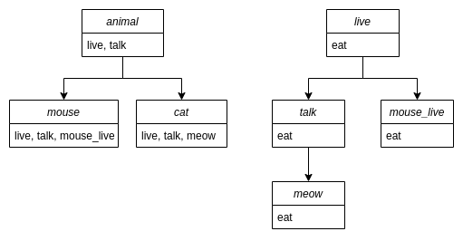

[](https://www.elegantobjects.org)
[](http://www.rultor.com/p/objectionary/deog)
[](https://www.jetbrains.com/idea/)

[//]: # ([![mvn]&#40;https://github.com/objectionary/deog/actions/workflows/build.yml/badge.svg?branch=master&#41;]&#40;https://github.com/objectionary/deog/actions/workflows/build.yml&#41;)
[//]: # ([![Hits-of-Code]&#40;https://hitsofcode.com/github/objectionary/deog&#41;]&#40;https://hitsofcode.com/view/github/objectionary/deog&#41;)
[](https://github.com/objectionary/deog/blob/master/LICENSE.txt)

### Decoration graph of EO program

DEOG is a JVM API for building decoration graph of EO program.

DEOG takes a path to a collection of `.xmir` files and constructs a decoration graph, connecting all the EO objects.
With this graph you can access the list of all the attributes present in an object in constant time.


### Usage

#### Installation
Just add this to your pom.xml file
```
<dependency>
  <groupId>org.eolang</groupId>
  <artifactId>deog</artifactId>
  <version>0.0.3</version>
</dependency>
```

### API

You can build a graph like this:
```
DeogLauncher.launchDeog(PATH_TO_XMIR_SOURCES, "postfix")
```
By default, DEOG will generate a new directory with a name `${PATH_TO_XMIR_SOURCES}_deog`, but you can change the postfix with the `postfix` parameter.

`launchDeog` returns a `DeogGraph` object, which has a number of useful attributes, i.g. you can look at the set of nodes of a graph via `deogGraph.dgNodes`

Nodes are represented by `DGraphNode` object with parameters such as
* `name` - EO object name
* `packageName` - EO package name
* `attributes` - representing eo attributes
* `children` and `parents` in the graph
* `body` - corresponding `org.w3c.dom.Node`

Each EO attribute is represented by `DGraphAttr` object with parameters such as
* `name` - EO object name
* `parentDistance` - distance in the decoration tree to the object in which the attribute was initially defined
* `body` - corresponding `org.w3c.dom.Node`

Below you can see a usage example:
```
val graph = DeogLauncher.launchDeog(PATH_TO_XMIR_SOURCES, "deog")
graph.dgNodes.forEach { node ->          // traversing each node
    if (node.name?.startsWith("a")) {    // checking if node name starts with "a"
        node.attributes.forEach {        // traversing node attributes
            println(it.name)             // printlng out attribute name
        }
    }
}
```

`AttributesUtil` file provides a useful API for getting quick access to `org.w3c.dom.Node` objects' attributes.

For instance, this is how you would access the `line` attribute of EO object: `line(node)`
You also can find which abstract object the `ref` attribute points to like this:
```
findRef(
    node,                       // node, ref of which you want to find
    deogGraph.initialObjects,   // initial set of org.w3c.dom.Node objects
    deogGraph                   // graph
)
```

### Graph overview:

Consider the following EO program.

```
[] > animal
  [] > live
    [] > eat
      stdout > @
        "Animal is eating"
    stdout > @
      "Animal is alive"
  [t] > talk
    live > @

[] > mouse
  animal > @
  [] > mouse_live
    ^.live > @

[] > cat
  animal > @
  [m] > meow
    ^.talk "Meow" > @
```

The resulting graph can be considered to look like below. Each node is represented by a rectangle.
All the attributes of the node are listed in the rectangle.


